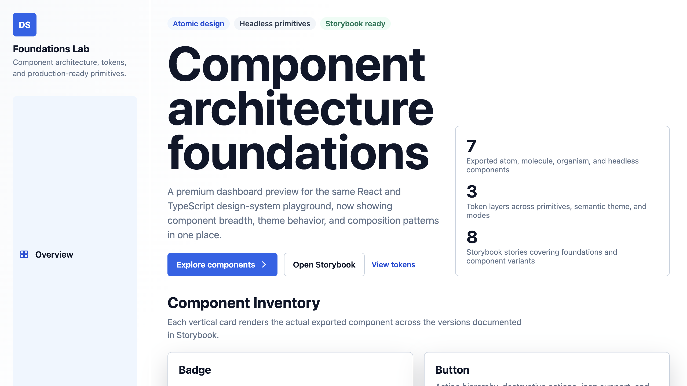
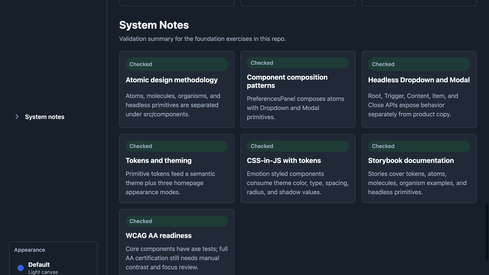
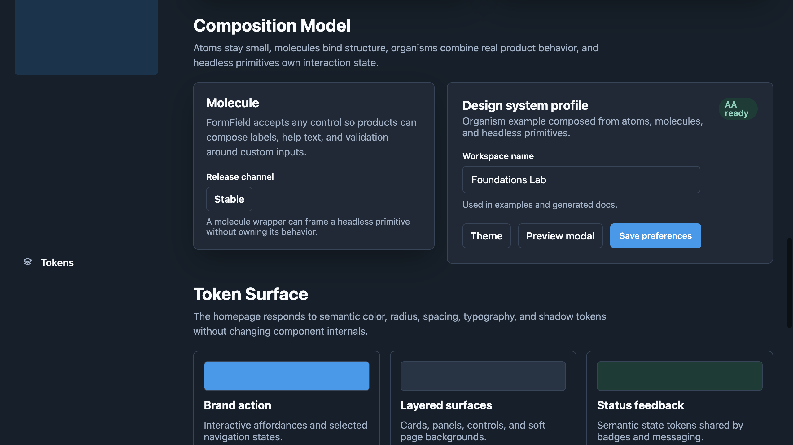
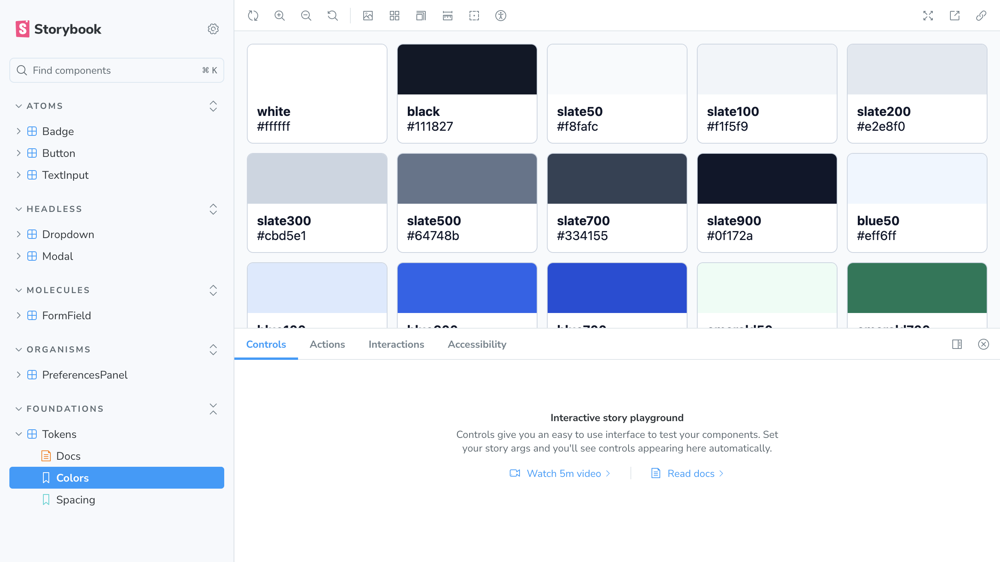
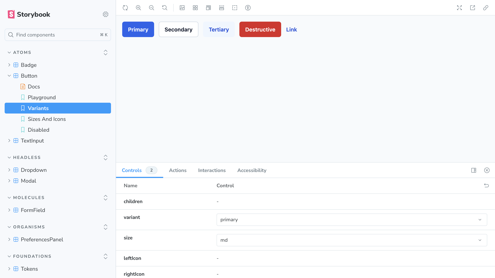
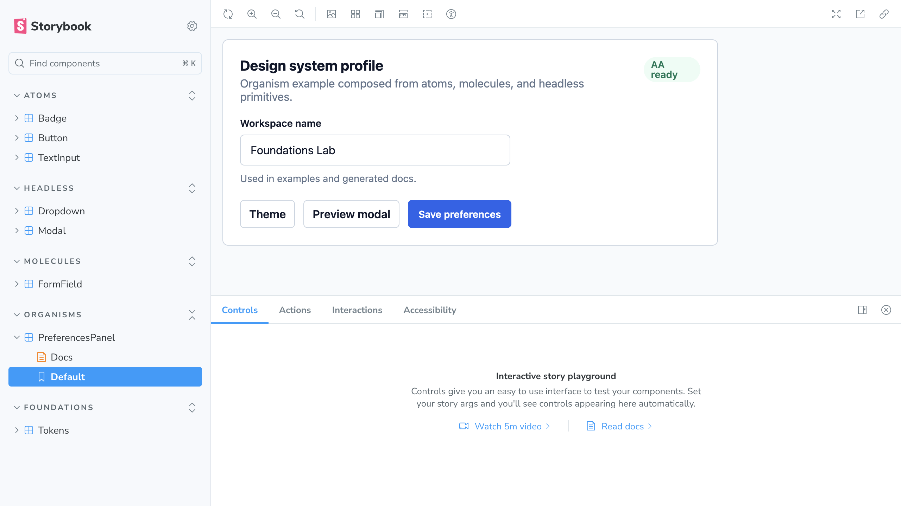

# Component Architecture and Design System Foundations

A React, TypeScript, Emotion, Storybook, Vitest, and Cypress workspace for practicing production-minded design-system foundations.

The project demonstrates atomic component organization, token-driven styling, compound/headless component APIs, Storybook documentation, accessibility checks, integration tests, and a product-style HomePage that exercises the system in context.

## Screenshots

### HomePage

Default landing view:



Dim theme mode:



Composition section:



### Storybook

Token documentation:



Button variants:



Organism example:



## Goals Covered

| Learning item | Coverage |
| --- | --- |
| Atomic design methodology | Components are organized as atoms, molecules, organisms, and headless primitives. |
| Build design-system foundation | Tokens, components, docs, tests, and a composed HomePage are included. |
| Component composition patterns | `FormField`, `PreferencesPanel`, and the HomePage demonstrate composition. |
| Headless component architecture | `Dropdown` and `Modal` use compound component APIs with behavior separated from page content. |
| Design tokens and theming | Primitive tokens feed semantic theme values and HomePage theme modes. |
| CSS-in-JS with tokens | Emotion styled components consume the shared token theme. |
| Storybook documentation | Tokens, atoms, headless primitives, molecule, and organism stories are documented. |
| Accessibility in design system | Components have jest-axe, keyboard behavior, interaction, and Cypress coverage. |

Note: automated tests are not a full substitute for a manual WCAG AA audit. The repo has strong accessibility coverage for labels, ARIA wiring, keyboard interaction, focus behavior, and axe checks, but a formal AA claim should also include manual screen-reader, contrast, and focus-order review.

## Tech Stack

- React 18
- TypeScript
- Vite
- Emotion CSS-in-JS
- Storybook 8
- Vitest
- Testing Library
- jest-axe
- Cypress

## Quick Start

```bash
npm install
npm run dev
```

The app runs through Vite. Storybook and tests are separate commands:

```bash
npm run storybook
npm test
npm run test:e2e
npm run build
npm run build-storybook
```

## Scripts

| Script | Purpose |
| --- | --- |
| `npm run dev` | Start the Vite app for local development. |
| `npm run dev:e2e` | Start Vite on `127.0.0.1:5173` with a strict port for Cypress. |
| `npm run storybook` | Start Storybook on port `6006`. |
| `npm run build-storybook` | Build static Storybook output into `storybook-static`. |
| `npm test` | Run Vitest unit, integration, and accessibility tests. |
| `npm run test:watch` | Run Vitest in watch mode. |
| `npm run test:e2e` | Start Vite and run Cypress headlessly. |
| `npm run test:e2e:open` | Open Cypress interactively. |
| `npm run build` | Type-check and build the production app. |

The Cypress scripts explicitly unset `ELECTRON_RUN_AS_NODE` because that environment variable can cause Cypress/Electron to launch incorrectly in this shell.

## Repository Map

```text
.
├── cypress/
│   ├── e2e/
│   │   └── HomePage.e2e.test.tsx
│   └── tsconfig.json
├── docs/
│   └── screenshots/
├── src/
│   ├── components/
│   │   ├── atoms/
│   │   │   ├── Badge/
│   │   │   ├── Button/
│   │   │   └── TextInput/
│   │   ├── molecules/
│   │   │   └── FormField/
│   │   ├── organisms/
│   │   │   └── PreferencesPanel/
│   │   ├── headless/
│   │   │   ├── Dropdown/
│   │   │   └── Modal/
│   │   ├── a11y.test.tsx
│   │   └── composition.integration.test.tsx
│   ├── home/
│   │   ├── HomePage.tsx
│   │   ├── HomePage.styles.ts
│   │   ├── icons.tsx
│   │   └── theme.ts
│   ├── styles/
│   ├── test/
│   └── tokens/
├── .storybook/
├── cypress.config.ts
├── vite.config.ts
└── package.json
```

## Design Tokens

Tokens are split into primitive and semantic layers.

### Primitive Tokens

Defined in `src/tokens/primitives.ts`.

Primitive tokens are raw design values:

- `color`: foundational color palette
- `font.family`: app font stack
- `font.size`: `xs`, `sm`, `md`, `lg`, `xl`
- `font.weight`: regular through bold
- `font.lineHeight`: tight and normal
- `space`: spacing scale
- `radius`: corner-radius scale
- `shadow`: focus and floating shadows

### Semantic Theme

Defined in `src/tokens/semantic.ts`.

The semantic theme maps primitives into UI roles:

- `background`
- `surface`
- `surfaceMuted`
- `text`
- `textMuted`
- `border`
- `borderStrong`
- `focus`
- `brand`
- `neutral`
- `success`
- `warning`
- `danger`

Components consume semantic tokens rather than hard-coding primitive color names. That keeps component intent stable even when the palette changes.

### HomePage Theme Modes

Defined in `src/home/theme.ts`.

The HomePage supports:

- Default
- Dim
- Lights out

These modes wrap the page in Emotion's `ThemeProvider` and override semantic tokens while preserving the component APIs.

## Component Architecture

### Atoms

Atoms are small, reusable, theme-aware components.

#### `Badge`

Location: `src/components/atoms/Badge`

Capabilities:

- Tones: `neutral`, `brand`, `success`, `warning`, `danger`
- Sizes: `sm`, `md`, `lg`
- Forwards native span attributes
- Uses semantic status and brand tokens

Storybook:

- `Atoms/Badge`

Tests:

- Renders content
- Forwards attributes
- Included in axe checks

#### `Button`

Location: `src/components/atoms/Button`

Capabilities:

- Variants: `primary`, `secondary`, `tertiary`, `destructive`, `link`
- Sizes: `md`, `lg`, `xl`, `2xl`
- `leftIcon` and `rightIcon`
- `iconOnly` mode with accessible labels
- Disabled state
- Token-based focus styles

Storybook:

- `Atoms/Button`

Tests:

- Default `type="button"`
- Click behavior
- Disabled click protection
- Icon-only accessible naming

#### `TextInput`

Location: `src/components/atoms/TextInput`

Capabilities:

- Label association
- Hint text
- Error text with `role="alert"`
- `aria-describedby` wiring
- `aria-invalid`
- Left and right icon slots
- Disabled state
- Ref forwarding

Storybook:

- `Atoms/TextInput`

Tests:

- Label-to-input association
- Hint and error accessible description
- User typing
- Disabled state
- Ref forwarding

### Molecules

Molecules compose smaller components or controls into a reusable structure.

#### `FormField`

Location: `src/components/molecules/FormField`

Capabilities:

- Accepts arbitrary `control`
- Renders label, description, and error content
- Works with both input controls and headless primitives

Storybook:

- `Molecules/FormField`
- `WithTextInput`
- `WithHeadlessControl`

Tests:

- Renders label, description, and control
- Renders error messaging

### Organisms

Organisms combine atoms, molecules, and headless primitives into a larger product-facing unit.

#### `PreferencesPanel`

Location: `src/components/organisms/PreferencesPanel`

Capabilities:

- Composes `Badge`, `Button`, `TextInput`, `Dropdown`, and `Modal`
- Demonstrates design-system composition in a realistic panel
- Includes nested menu and dialog flows

Storybook:

- `Organisms/PreferencesPanel`

Tests:

- Renders composed content
- Opens nested dropdown
- Opens nested modal

### Headless Primitives

Headless primitives expose compositional APIs and interaction behavior. They include local styling in this exercise, but their public API separates behavior from consuming page content.

#### `Dropdown`

Location: `src/components/headless/Dropdown`

API:

```tsx
<Dropdown.Root>
  <Dropdown.Trigger>Actions</Dropdown.Trigger>
  <Dropdown.Content aria-label="Actions">
    <Dropdown.Item>Duplicate</Dropdown.Item>
  </Dropdown.Content>
</Dropdown.Root>
```

Capabilities:

- Controlled and uncontrolled open state
- `aria-haspopup="menu"`
- `aria-expanded`
- `role="menu"`
- `role="menuitem"`
- Disabled items
- Arrow-key movement
- Escape dismissal
- Focus return to trigger after selection

Storybook:

- `Headless/Dropdown`

Tests:

- Open/select/close behavior
- Controlled open state
- Keyboard navigation
- Escape dismissal

#### `Modal`

Location: `src/components/headless/Modal`

API:

```tsx
<Modal.Root>
  <Modal.Trigger>Open modal</Modal.Trigger>
  <Modal.Content aria-labelledby="modal-title">
    <h2 id="modal-title">Dialog title</h2>
    <Modal.Close>Close</Modal.Close>
  </Modal.Content>
</Modal.Root>
```

Capabilities:

- Controlled and uncontrolled open state
- Portal rendering
- `role="dialog"`
- `aria-modal="true"`
- `aria-labelledby`
- Escape dismissal
- Backdrop dismissal
- Focus entry
- Body scroll lock while open

Storybook:

- `Headless/Modal`

Tests:

- Open and close flow
- Controlled open state callbacks
- Escape dismissal
- Body overflow cleanup

## HomePage

Location: `src/home/HomePage.tsx`

The HomePage is the product-facing integration layer for the design system. It renders actual exported components and demonstrates how tokens, theme modes, atomic structure, headless primitives, and Storybook documentation fit together.

Key sections:

- `Overview`: hero summary and system metrics
- `Components`: rendered atom and headless primitive inventory
- `Composition`: molecule and organism examples
- `Tokens`: semantic token surface
- `System notes`: validation checklist

Navigation behavior:

- Sidebar items are data-driven from `navItems`
- The active item is stored in `activeSection`
- Clicked items receive `aria-current="page"`
- Hash navigation updates active state through `hashchange`

## Storybook

Storybook is configured in `.storybook`.

Configuration:

- `@storybook/react-vite`
- Essentials addon
- Interactions addon
- A11y addon
- Emotion theme decorator
- Autodocs enabled

Documented stories:

- `Foundations/Tokens`
- `Atoms/Badge`
- `Atoms/Button`
- `Atoms/TextInput`
- `Molecules/FormField`
- `Organisms/PreferencesPanel`
- `Headless/Dropdown`
- `Headless/Modal`

Run Storybook:

```bash
npm run storybook
```

Build static docs:

```bash
npm run build-storybook
```

## Testing Strategy

### Unit Tests

Unit tests live next to components.

Examples:

- `src/components/atoms/Button/Button.test.tsx`
- `src/components/headless/Dropdown/Dropdown.test.tsx`
- `src/components/organisms/PreferencesPanel/PreferencesPanel.test.tsx`

They cover:

- Rendering
- Props
- Events
- Disabled states
- Keyboard behavior
- Controlled/uncontrolled behavior
- ARIA contracts

### Integration Tests

Integration flows live in:

```text
src/components/composition.integration.test.tsx
```

They cover:

- `FormField` composed with `TextInput`
- `FormField` composed with `Dropdown`
- Modal content composed with design-system actions
- `PreferencesPanel` nested dropdown and modal behavior

### Accessibility Tests

Accessibility tests live in:

```text
src/components/a11y.test.tsx
```

They use:

- Testing Library
- jest-axe
- User events

Covered checks:

- Atoms render without axe violations
- Molecule and organism compositions render without axe violations
- Text input labels and help/error text are accessible
- Dropdown and Modal keyboard interactions work

### Cypress E2E

Cypress config:

```text
cypress.config.ts
```

Spec:

```text
cypress/e2e/HomePage.e2e.test.tsx
```

Covered browser flows:

- Sidebar active state
- Theme switching
- Dropdown interactions
- Modal interactions
- Composition section
- System validation content

Run:

```bash
npm run test:e2e
```

Open interactive Cypress:

```bash
npm run test:e2e:open
```

## TypeScript Notes

The main app TypeScript config intentionally includes only:

```json
["src", ".storybook"]
```

Cypress has its own config:

```text
cypress/tsconfig.json
```

This prevents Cypress globals from leaking into the app and Vitest type context.

## Accessibility Status

The system includes practical accessibility coverage:

- Labels and `aria-describedby` for `TextInput`
- `role="alert"` for validation errors
- Focus styles from shared tokens
- Keyboard navigation in `Dropdown`
- Escape dismissal in `Dropdown` and `Modal`
- `role="dialog"` and `aria-modal` in `Modal`
- Focus entry and scroll lock in `Modal`
- `aria-current="page"` for active sidebar navigation
- jest-axe checks for core component compositions
- Cypress browser coverage for key HomePage flows

Remaining work before claiming formal WCAG AA certification:

- Manual screen-reader pass
- Manual focus-order pass across all stories and the HomePage
- Manual or automated contrast audit for every theme mode
- Browser-level axe scan in Cypress, for example with `cypress-axe`

## Recommended Workflow

1. Update or add primitive tokens in `src/tokens/primitives.ts`.
2. Map primitives into semantic roles in `src/tokens/semantic.ts`.
3. Build or update components inside the atomic folder structure.
4. Add or update Storybook stories.
5. Add unit tests for component behavior.
6. Add integration tests for composition flows.
7. Add Cypress coverage for critical user paths.
8. Run the full verification set.

## Verification Commands

```bash
npm test
npm run test:e2e
npm run build
npm run build-storybook
```

These commands were used to verify the current implementation.
